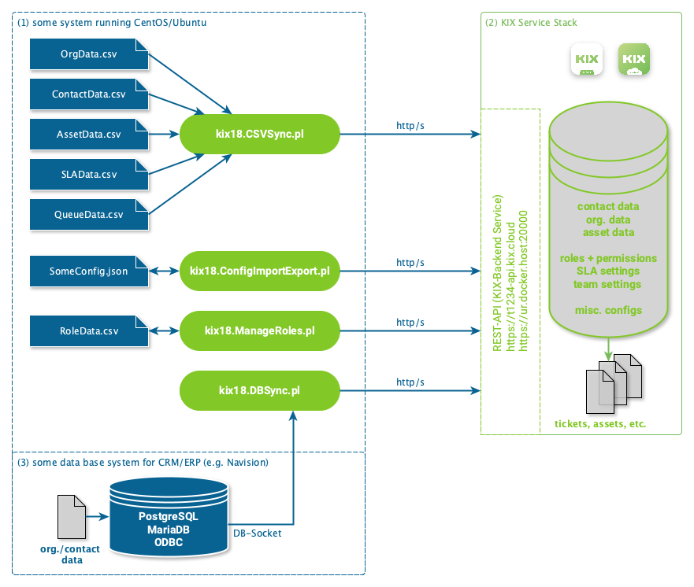

# kix18sync

To provide simple tools to import data into KIX18 by using its REST-API, data sources may be remote DB tables or CSV files.

These scripts are intented to work as **external tools** accessing KIX only by its REST-API. There might be this thing called "internet" between KIX backend and your system running this script.



Of course these scripts can be used on your docker host, running KIX. However this scenario is not a generic use case. These scripts **do not** evaluate your docker setup environment files. Therefore, keep in mind to give proper configuration of the KIX-REST **Backend** API, that is correct port number if running on the docker host.


## Contents/Structure
- directory `bin`: scripts for data synchronization
- directory `config`: default/sample configuration
- directory `sample`: sample import data (CSV)

## Required Perl Packages

Scripts have been developed using CentOS8 or Ubuntu/Debian as target plattform. Following packages must be installed:

- CentOS/RHEL
```
shell> sudo yum install perl-Config-Simple perl-REST-Client perl-JSON perl-LWP-Protocol-https perl-DBI perl-URI perl-Pod-Usage perl-Getopt-Long perl-Text-CSV
```
- Ubuntu/Debian
```
shell> sudo apt install libconfig-simple-perl librest-client-perl libjson-perl liblwp-protocol-https-perl libdbi-perl liburi-perl perl-doc libgetopt-long-descriptive-perl libtext-csv-perl
```


----
## Configuration Import Export - kix18.ConfigImportExport.pl

Script `bin/kix18.ConfigImportExport.pl` exports and imports various complex configuration objects from/to KIX backends, currently including
- DynamicField
- Job
- ObjectAction
- ReportDefinition
- Template
- TicketType
- TicketState
- Team
- TemplateCategory
- SysConfigOptionDefinition

### Usage

Provide parameter `--if` (input file) in order to import a configuration. It maybe helpful to use verbose if your configuration cannot be uploaded. Furthermore it is recommended to clear the backend cache of KIX after importing configurations.

Provide parameter `--of` or `--od` (output file/directory) in order to export configuration. It maybe helpful to use verbose if filters to not show effect.

```
./bin/kix18.ConfigImportExport.pl --help
./bin/kix18.ConfigImportExport.pl --config ./config/kix18.ConfigImportExport.cfg --od /tmp --ft DynamicField --fn *Close*
./bin/kix18.ConfigImportExport.pl --config ./config/kix18.ConfigImportExport.cfg --if ./sample/ImportConfig_Sample.json --verbose 2
```

The script can be used by referring to a configuration instead of requiring each parameter from command line. Please call `./bin/kix18.ConfigImportExport.pl --help` for a detailed parameter listing.

- `config`: path to configuration file instead of command line params
- `url`: URL to KIX backend API (e.g. https://t12345-api.kix.cloud)
- `u`: KIX user login
- `p`: KIX user password
- `verbose`: makes the script verbose
- `nossl`: disables SSL verification on backend connect
- `help`: show help message
- `od`: to which directory the output should be written (setting triggers export, using filters)
- `of`: to which file the output should be written (setting triggersexport, using filters)
- `ft`: export filter: comma separates list of object types (e.g. DynamicField,Job,ObjectAction,ReportDefinition,Template)
- `fn`: export filter: pattern for object name applied in a LIKE search (e.g. *Close*), requires option "ft" to be set
  - if you're exporting SysConfig options use special name pattern `modified!` in order to export only SysConfig options which differ from default values
- `if`: source file which is uploaded in config import (setting triggers import)
- `im`: import setting: mode (one value of Default|ForceAdd|OnlyAdd|OnlyUpdate)


----
## Manage Roles and Permissions - kix18.ManageRoles.pl

Script `bin/kix18.ManageRoles.pl` retrieves role and permission infomation from a KIX18 by communicating with its REST-API.

The provided `RoleData_Sample.csv` contains default roles and permissions as delivered by KIX. We try to keep this up to date. However, this script collection is mostly a fun side project, so please bear with us if it should lag behind and give us a hint.

The script sort the provided role-permission by role name, target, type. Any output while processing the file refers to the sorted list. In order to make proper use of line information given by this script you should sort your CSV in advance.

### Usage

```
./bin/kix18.ManageRoles.pl --help
./bin/kix18.ManageRoles.pl --config ./config/kix18.ManageRoles.cfg --dir export -d /tmp
./bin/kix18.ManageRoles.pl --config ./config/kix18.ManageRoles.cfg --dir import --f ./sample/RoleData_Sample.csv --verbose 2
```


The script can be used by referring to a configuration and object type only. Any parameter given by command line overwrites values specified in the config file. Use `kix18.DBSync.pl --help` for a detailed parameter listing.


- `dir`: direction (import|export), "export" if not given
- `config`: path to configuration file instead of command line params
- `url`: URL to KIX backend API (e.g. https://t12345-api.kix.cloud)
- `u`: KIX user login
- `p`: KIX user password
- `d`: output directory to which role permissions are written (if direction "export")
- `f`: input file (if direction "import")
- `verbose`: makes the script verbose (1..4)
- `help`: show help message

#### Resolving Team-/Queue-Names

The script is able to resolve team names given in permissions by `<TeamName2ID:Some::Full::Team::Name>` instead of numeric IDs. This is only supported in import. If a team name cannot be resolved the given pattern is replaced by `UnknownTeam_Some::Full::Team::Name`.


### Configuration

Required configuration may to be placed in a separate config file which is read upon script execution. A sample config might look like this:

```
# KIX18 params for information retrieval...
[KIXAPI]
KIXUserName        = "API-User"
KIXPassword        = "API-User-Password"
KIXURL             = http://localhost:20000
Proxy              = ""
NoSSLVerify        = "1"
APITimeOut         = 30

# CSV configuration ...
[CSV]
#Direction          = "export"
#CSVOutputDir       = "/tmp"
#CSVFile            = "/tmp/some.csv"
#CSVSeparator       = TAB
CSVSeparator       = ";"
CSVEncoding        = "utf-8"
CSVQuote           = "\""
```


----
## Sync from CSV-File - kix18.CSVSync.pl

Script `bin/kix18.CSVSync.pl` provides a client for importing data from CSV files to KIX18 REST-API, supporting
- Contact (including user)
- Organisation
- SLA

Users are created/updated if a data for `Login` is given. Only then further columns such as `Password`, `Roles`, `IsAgent` and `IsCustomer` are considered at all. If there is no user context (`IsAgent` or  `IsCustomer`) set, the users account will be set to `invalid`.  `Roles` must contain **comma-separated names of roles** existing in your KIX. Only roles which match the given usage context (`IsAgent` or  `IsCustomer`) are accepted. Predefined default roles `Agent User` or `Customer` are added automatically by the script depending on the users context (hopefully no one renamed them). Non-existing or misspelled **roles will not be created.**

Dynamic Field values are split along comma and submitted as arrays by default, see config file option `DFArrayCommaSplit`.

### Required Perl Packages

For handling CSV following packages need to be installed additionally:

- CentOS
```
shell> sudo yum install libtext-csv-perl
```
- Ubuntu/Debian
```
shell> sudo apt install perl-Text-CSV
```


### Usage

Import organisations given by CSV data:
`./bin/kix18.CSVSync.pl --config ./config/kix18.CSVSync.cfg --ot Organisation --if ./sample/OrgData_Sample.csv --verbose 3`

Import contacts given by CSV data:
`./bin/kix18.CSVSync.pl --config ./config/kix18.CSVSync.cfg --ot Contact --if ./sample/ContactData_Sample.csv  --verbose 3`

Import SLAs given by CSV data:
`./bin/kix18.CSVSync.pl --config ./config/kix18.CSVSync.cfg --ot SLA --if ./sample/SLAData_Sample.csv  --verbose 3`

Import location assets given by CSV data:
`./bin/kix18.CSVSync.pl --config ./config/kix18.CSVSync.cfg --ot Asset --if ./sample/AssetData00_Location_Sample.csv --ac Location`

Import building assets given by CSV data:
`./bin/kix18.CSVSync.pl --config ./config/kix18.CSVSync.cfg --ot Asset --if ./sample/AssetData01_Building_Sample.csv --ac Building`

Import room assets given by CSV data:
`./bin/kix18.CSVSync.pl --config ./config/kix18.CSVSync.cfg --ot Asset --if ./sample/AssetData02_Room_Sample.csv --ac Room`

Import network assets given by CSV data:
`./bin/kix18.CSVSync.pl --config ./config/kix18.CSVSync.cfg --ot Asset --if ./sample/AssetData03_Network_Sample.csv --ac Network -verbose 5`

Import software assets given by CSV data:
`./bin/kix18.CSVSync.pl --config ./config/kix18.CSVSync.cfg --ot Asset --if ./sample/AssetData04_Software_Sample.csv --ac Software -verbose 4`

Import computer assets given by CSV data:
`./bin/kix18.CSVSync.pl --config ./config/kix18.CSVSync.cfg --ot Asset --if ./sample/AssetData05_Computer_Sample.csv --ac Computer -verbose 4`

Import hardware assets given by CSV data:
`./bin/kix18.CSVSync.pl --config ./config/kix18.CSVSync.cfg --ot Asset --if ./sample/AssetData06_Hardware_Sample.csv --ac Hardware -verbose 4`

Import services given by CSV data:
`./bin/kix18.CSVSync.pl --config ./config/kix18.CSVSync.cfg --ot Asset --if ./sample/AssetData10_Service_Sample.csv --ac Service -verbose 4`


Generic use (without specific options, which may be required):
`./bin/kix18.CSVSync.pl --config ./config/kix18.CSVSync.cfg --ot Contact|User|Organisation|SLA|Asset|Queue`

The script can be used by referring to a configuration and object type only. Any parameter given by command line overwrites values specified in the config file. Use `kix18.CSVSync.pl --help` for a detailed parameter listing.

- `config`: path to configuration file instead of command line params
- `ot`: object to be imported (Contact|Organisation|SLA|Asset|Queue)
- `ac`: asset class name (required for asset import)
- `url`: URL to KIX backend API (e.g. https://t12345-api.kix.cloud)
- `u`: KIX user login
- `p`: KIX user password
- `verbose`: makes the script verbose (use `--verbose 4` for max. verbosity)
- `help`: show help message
- `i`: source directory from which CSV-files matching name patterns fpr object type are read
- `if`: source file for import (if given, option `i` is ignored)
- `o`: destination directory, where result summary is written
- `r`: if set, import files are deleted after processing
- `fpw`: if set, an updated user will get the password specified by the import data


Depending on the object type, any CSV files matching name pattern from the input directory are read. File which names contain  `Result` are omitted. For each import file a `SourceFileName.Result.csv` is written. Name patterns are ignored if a specific file name is given.

- object type `Asset`: name pattern `*Asset*.csv`
- object type `Contact`: name pattern `*Contact*.csv`
- object type `Organisation`: name pattern `*Org*.csv`
- object type `SLA`: name pattern `*SLA*.csv`
- object type `Queue`: name pattern `*Queue*.csv`


### Configuration

Most configuration has to be placed in a separate config file which is read upon script execution. A sample config might look like this:

```
# KIX18 params for information retrieval...
[KIXAPI]
KIXUserName        = "API-User"
KIXPassword        = "API-User-Password"
KIXURL             = http://localhost:20000
Proxy              = ""
APITimeOut         = 30
ObjectType         = ""
NoSSLVerify        = "1"

# CSV configuration ...
[CSV]
RemoveSourceFile   = ""
#CSVSeparator       = TAB
CSVSeparator       = ";"
CSVInputDir        = "/workspace/tools/kix18sync/sample"
CSVOutputDir       = "/workspace/tools/kix18sync/sample"
CSVEncoding        = "utf-8"
CSVQuote           = "\""
#CSVQuote           = "none"
DFArrayCommaSplit  = "1"

# Mapping behaviors
Contact.AutoAddContextRoles          = "0"
Contact.SearchColIndex               = "0"
Contact.IdentifierAttribute          = "UserLogin" 
#Contact.IdentifierAttribute          = "Email" 

# Mapping configuration ...
Contact.ColIndex.Login               = "0"
Contact.ColIndex.Email               = "1"
Contact.ColIndex.Email1              = "2"
Contact.ColIndex.Email2              = "3"
Contact.ColIndex.Email3              = "4"
Contact.ColIndex.Email4              = "5"
Contact.ColIndex.Email5              = "6"
Contact.ColIndex.Firstname           = "7"
Contact.ColIndex.Lastname            = "8"
Contact.ColIndex.Title               = "9"
Contact.ColIndex.Street              = "10"
Contact.ColIndex.City                = "11"
Contact.ColIndex.Zip                 = "12"
Contact.ColIndex.Country             = "13"
Contact.ColIndex.Phone               = "14"
Contact.ColIndex.Mobile              = "15"
Contact.ColIndex.Fax                 = "16"
Contact.ColIndex.Comment             = "17"
Contact.ColIndex.PrimaryOrgNo        = "18"
#Contact.ColIndex.ValidID            = "19"
Contact.ColIndex.ValidID             = "SET:1"
Contact.ColIndex.Password            = "20"
Contact.ColIndex.Roles               = "21"
Contact.ColIndex.IsAgent             = "22"
#Contact.ColIndex.IsAgent             = "SET:1|0"
Contact.ColIndex.IsCustomer          = "23"
#Contact.ColIndex.IsCustomer          = "SET:1|0"
Contact.ColIndex.DynamicField_Source = "24"
Contact.ColIndex.OrgNumbers          = "25"


#NOTE: Organisation.Number is used as identifier
Org.SearchColIndex             = "0"
Org.ColIndex.Number            = "0"
Org.ColIndex.Name              = "1"
Org.ColIndex.Comment           = "2"
Org.ColIndex.Street            = "3"
Org.ColIndex.City              = "4"
Org.ColIndex.Zip               = "5"
Org.ColIndex.Country           = "6"
Org.ColIndex.Url               = "7"
Org.ColIndex.DynamicField_Type = "8"
Org.ColIndex.ValidID           = "SET:1"

#NOTE: SLA.Name is used as identifier
SLA.ColIndex.Name                = "0"
SLA.ColIndex.Calendar            = "1"
SLA.ColIndex.ValidID             = "2"
SLA.ColIndex.Comment             = "3"
SLA.ColIndex.FirstResponseTime   = "4"
SLA.ColIndex.FirstResponseNotify = "5"
SLA.ColIndex.SolutionTime        = "6"
SLA.ColIndex.SolutionTimeNotify  = "7"

#NOTE: Queue.FullQueueName is used as identifier
Queue.ColIndex.FullQueueName      = "0"
Queue.ColIndex.Calendar           = "1"
Queue.ColIndex.Comment            = "3"
Queue.ColIndex.FollowUpID         = "4"
Queue.ColIndex.ParentID           = "5"
Queue.ColIndex.RealName           = "6"
Queue.ColIndex.SystemAddress      = "7"
Queue.ColIndex.UnlockTimeOut      = "8"
Queue.ColIndex.ValidID            = "2"
```

### Asset Data Import

There is no need to define a custom mapping of CSV-rows to asset-attributes. Instead such mapping information must be included in CSV files itself by providing a corresponding header line (1st line). You may use exports created by KIX18 GUI asset export as sample or (recommended) just have a look at the provided examples in order to understand how it works. Keep in mind that your asset class definitions may vary from the default settings. The script acts within the boundaries of a single asset class defined by parameter `--ac`.

`./bin/kix18.CSVSync.pl --config ./config/kix18.CSVSync.cfg --ot Asset --if ./sample/AssetData04_Computer_Sample.csv --ac Computer`

If you do not have CSV files with proper headlines defining an attribute mapping, you may **u**se this **a**sset **m**apping in your config file. In order to use such a mapping option `uam` needs to be set. Keep in mind, that your CSV file must not contain any headline then.

`./bin/kix18.CSVSync.pl --config ./config/kix18.CSVSync.cfg --ot Asset --if ./sample/AssetData04_Computer_Sample.csv --ac Computer --uam`

#### Update Behavior

If an asset number is given the script will update this item, only if the asset number can be found. It automatically create an asset within the given class if no or an invalid asset number ist given, but **will not** us a given invalid number to do so(!). Asset numbers are generated by KIX itself. You may facilitate asset automation, in order to enforce a predefined asset number.

If your asset names are unique you can use option `anl`, which enables **a**sset **n**ame **l**ookup if no or an invalid asset number is given.

`./bin/kix18.CSVSync.pl --config ./config/kix18.CSVSync.cfg --ot Asset --if ./sample/AssetData04_Computer_Sample.csv --ac Computer --anl`


The script **does not** preserve values of previous versions of the updated asset (...yet. it implements an "all-or-nothing-update-approach"). So far there is no default value option for deployment- nor incident-state available. You may use predefined static values within a configuration mapping.


### Contact with Multiple Organizations

KIX18 allows for multiple organization support, that is assigning a contact to multiple organizations. You can do this by providing a *comma-separated list of organization numbers* in **one** import attribute `OrgNumbers`. This simple approach is supported by `kix18.CSVSync.pl` and `kix18.DBSync.pl`. However, a contact is **always** assigned to its primary organization. The import **does not** check if the primary organization is contained in the list of all organizations, rather the primary organization is added to that list if not already included. 


### Contact vs. Users?

KIX18 differs between user accounts and contacts. Contacts are just contact information of a person or functional mailbox. A contact **might** be associated with a user account which allows the person/contact to log into KIX. The UsageContext defines whether it's possible to login as customer, (i.e. Self Service Portal user), or agent user. If a provided contact data set contains a UserLogin, user account information (password, roles and usage context flags IsAgent/IsCustomer) at all.

If you want to update contact information only, do not provide content in column for `UserLogin`.

If you want to create or update contact information and update or create corresponding user accounts, do provide content in column for `UserLogin`.

If you want to update existing user accounts with new role assignments, then ObjectType User should be used (`--ot User`). Any non related contact information will not be touched. This option **does not** create new user accounts.


### Queue vs. Teams?

KIX18 uses a more understandable wording for "queues" which are some sort of assignee groups to which tickets are assigned. A group of people working together to solve incidents, answer requests or plan changes. One could call these people "a team". However, due to historic reasons the original naming "queues" is still used in the API. Therefore we stick to "queues" in this script so far.


----
## Sync from Database Source - kix18.DBSync.pl

Script `bin/kix18.DBSync.pl` provides a client for importing data from a remote DB to KIX18 REST-API, supporting Contact and Organisation (so far).

Dynamic Field values are split along comma and submitted as arrays by default, see config file option `DFArrayCommaSplit`.

### Required Perl Packages

Depending on the DBMS to be connected, additional packages might be required, e.g.
- CentOS
```
shell> sudo yum install perl-DBD-Pg
shell> sudo yum install perl-DBD-MySQL
shell> sudo yum install perl-DBD-ODBC
```
- Ubuntu/Debian
```
shell> sudo apt install libdbd-pg-perl
shell> sudo apt install libdbd-mysql-perl
shell> sudo apt install libdbd-odbc-perl
```


### Usage
`./bin/kix18.DBSync.pl --config ./config/kix18.DBSync.cfg --ot Contact|Organisation`

The script can be used by referring to a configuration and object type only. Any parameter given by command line overwrites values specified in the config file. Use `kix18.DBSync.pl --help` for a detailed parameter listing.

- `config`: path to configuration file instead of command line params
- `ot`: object to be imported (Contact|Organisation)
- `url`: URL to KIX backend API (e.g. https://t12345-api.kix.cloud)
- `u`: KIX user login
- `p`: KIX user password
- `du`: DBUser  (if not given by config)
- `dp`: DBPassword (if not given by config)
- `verbose`: makes the script verbose (use `--verbose 4` for max. verbosity)
- `help`: show help message


### Configuration

The major configuration has to be placed in a separate config file which is read upon script execution. A sample config might look like this:

```
# KIXAPI configuration
[KIXAPI]
KIXUserName        = "API-User"
KIXPassword        = "API-User-Password"
KIXURL             = http://localhost:20000
Proxy              = ""
APITimeOut         = 30

# DB configuration
[DB]
# DSN is the full DB connection string without username/password
#DSN                = "DBI:mysql:database=MyCRMDB;host=mariadb.server.local;"
#DSN                = "DBI:ODBC:MyODBCDBName"
DSN                = "DBI:Pg:dbname=kix17;host=kix.company.de;"
DBUser             = "SomeDBUser"
DBPassword         = "PASSWORD"
DFArrayCommaSplit  = "1"

# limit might be useful for testing (only for MySQL/MariaDB or PostgreSQL)...
DBLimit     = "100"

# following sections define the mapping of DB-tables to KIX-API resources
# Table        = "some_customer_user_table"
# Condition is optional and allows to filter relevant DB entries
# Condition    = "WHERE login != ''"
# OtherRessourceAttribute = "DB column name"
# if an attribute is not given in the DB-table it may be set to a fixed value by
# SomeRessourceAttribute = "SET:<fixedvaluehere>"

# Mapping configuration for contact items...
[Contact]
Table        = "some_customer_user"
Condition    = ""
# use condition if you want to sync. only newer entries, e.g.
# Condition    = " create_time > (current_timestamp - 86400)"
Email               = "email0"
Firstname           = "first_name"
Lastname            = "last_name"
Title               = "title"
Street              = "addr_street"
City                = "addr_city"
Zip                 = "addr_zip"
Country             = "addr_country"
Phone               = "phone1"
Mobile              = "phone2"
Fax                 = "fax1"
Comment             = "businessfnct"
PrimaryOrgNo        = "customer_id"
ValidID             = "SET:1"
#DynamicField_Source = "some_db_row"
DynamicField_Source = "SET:sample database"

# Mapping configuration for organisation items...
[Organisation]
Table             = "some_org"
Condition         = ""
Number            = "customer_id"
Name              = "name_org"
Comment           = "comments"
Street            = "addr_street"
City              = "addr_city"
Zip               = "addr_zip"
Country           = "addr_country"
Url               = "url"
ValidID           = "SET:1"
#DynamicField_Type = "SET:customer,internal supplier"
DynamicField_Type = "type"
```

PS: the DB-structure for this example in MariaDB/MySQL is contained in `sample/MyCRMDB.sql`

## Mailfilter Import - kix18.MailFilterImport.pl

Script `bin/kix18.MailFilterImport.pl` imports PostmasterFilter from KIX17 to KIX18


### Usage

Provide parameter `--if` (input file) export File from ConfigurationImportExport needed

```
./bin/kix18.MailfilterImport.pl --help
./bin/kix18.ConfigImportExport.pl --config ./config/kix18.MailFilter.cfg--if ./sample/PostmasterFilter_Sample.json --verbose 3
```

The script can be used by referring to a configuration instead of requiring each parameter from command line. Please call `./bin/kix18.kix18.MailfilterImport.pl --help` for a detailed parameter listing.

- `config`: path to configuration file instead of command line params
- `url`: URL to KIX backend API (e.g. https://t12345-api.kix.cloud)
- `u`: KIX user login
- `p`: KIX user password
- `verbose`: makes the script verbose
- `nossl`: disables SSL verification on backend connect
- `help`: show help message
- `if`: source file which is uploaded in config import (setting triggers import)

----
## Contributors

- David Bormann (Queue/Teams import)
